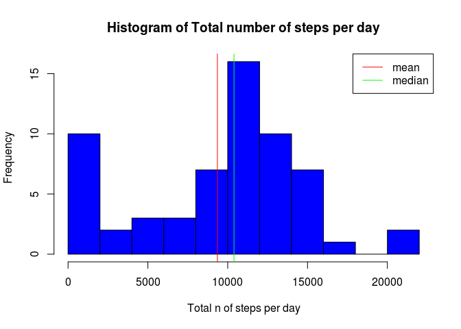
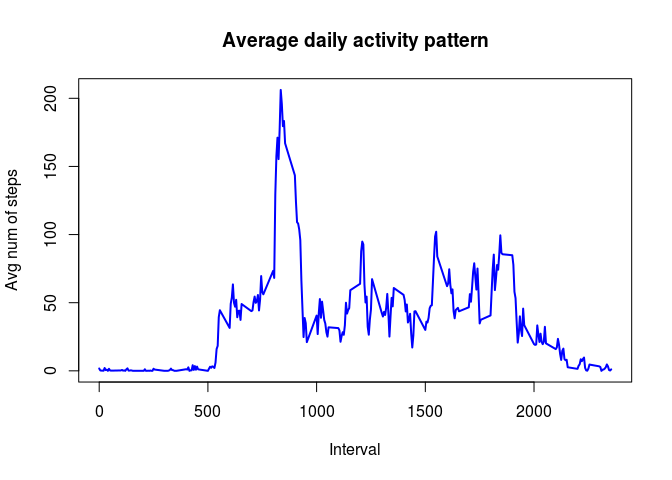
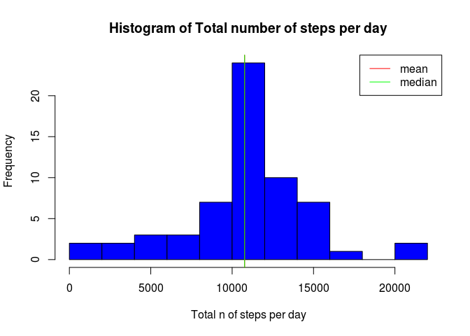
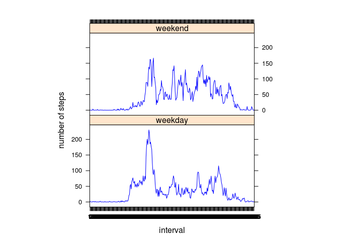

# Reproducible Research: Peer Assessment 1


## Loading and preprocessing the data
Convert the date variable in date format using lubridate package and create a factor variable from the interval variable


```r
library(lubridate)
data<-read.csv(file = "activity.csv", header = T, sep=",")
data$date<-ymd(data$date)
data$int_fac<-as.factor(data$interval)
```


## What is mean total number of steps taken per day?
Ignoring NA values in the dataset for now


```r
tot.stp<-tapply(data$steps,data$date,sum, na.rm=T)
hist(tot.stp, breaks=10, xlab = "Total n of steps per day", 
     main="Histogram of Total number of steps per day", col="blue")
m.stp<-mean(tot.stp, na.rm=T)
md.stp<-median(tot.stp, na.rm=T)
abline(v=m.stp,col="red")
abline(v=md.stp, col="green")
legend("topright", legend=c("mean", "median"), col=c("red", "green"), lty=1)
```

 

The histogram shows almost a normal distribution of the total number of steps per day, except for low tail of the distribution in the range 0 - 2000 that account for 10% of the total.

The mean value is 9354.2295, lower than the median value 10395.

## What is the average daily activity pattern?


```r
avg.stp<-tapply(data$steps,data$interval,mean, na.rm=T)
plot(levels(data$int_fac),avg.stp, type="l", col="blue", lwd=2, xlab="Interval",
     main="Average daily activity pattern", ylab="Avg num of steps")
```

 

```r
names(avg.stp)<-levels(data$int_fac)
max.avg.stp<-names(avg.stp)[avg.stp == max(avg.stp)]
```

The graph shows some peaks in the daily activity pattern, the 5-minute time interval containing the maiximum average number of steps is 835.


## Imputing missing values


```r
nas<-is.na(data$steps)
nas.num<-sum(nas)
nas.freq<-nas.num/length(data$steps)
```

The frequency of NA's in the datas is 0.1311. Quite high.
To fill in the NA's value in the dataset, I've substituted them with mean level of the corresponding 5-minutes interval creating a new dataset called data.all 


```r
data.all<-data
for (i in 1:length(data$steps)){
    if(is.na(data$steps[i])){
        data.all$steps[i]<-mean(data$steps[data$int_fac==data$int_fac[i]], na.rm=T)
    }
    else {
        data.all$steps[i]<-data$steps[i]
    }
}
```


```r
tot.stp.all<-tapply(data.all$steps,data.all$date,sum)
hist(tot.stp.all, breaks=10, xlab = "Total n of steps per day", 
     main="Histogram of Total number of steps per day", col="blue")
m.stp.all<-mean(tot.stp.all)
md.stp.all<-median(tot.stp.all)
abline(v=m.stp.all,col="red")
abline(v=md.stp.all, col="green")
legend("topright", legend=c("mean", "median"), col=c("red", "green"), lty=1)
```

 

The mean value is 1.0766 &times; 10<sup>4</sup>, and the median value is 1.0766 &times; 10<sup>4</sup>.


The histogram shows how the difference depends from the high percentage of lower value respect to the total; beacuse the high level of na's in the dataset (~13%) substituting them with the mean value for each 5 min period resulted shifting the median vs the mean.


## Are there differences in activity patterns between weekdays and weekends?


```r
library(lattice)
Sys.setlocale("LC_TIME", "en_US.UTF-8")
```

```
## [1] "en_US.UTF-8"
```

```r
weekday<-unique(weekdays(data$date))[1:5]
weekend<-unique(weekdays(data$date))[6:7]
data.all$weekday[weekdays(data.all$date) %in% weekday]<-"weekday" 
data.all$weekday[weekdays(data.all$date) %in% weekend]<-"weekend"
data.all$weekday<-as.factor(data.all$weekday)
stp.split<-aggregate(steps~int_fac+weekday, data=data.all, FUN = mean)
xyplot(steps~int_fac|weekday, data=stp.split,col = "blue", type = "l", aspect=1/2,
       xlab="interval",ylab="number of steps")
```

 

The plot shows that the activity is constantly higher during the weekend respect to the weekdays. 
